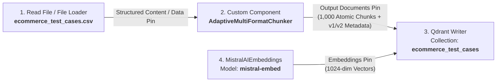
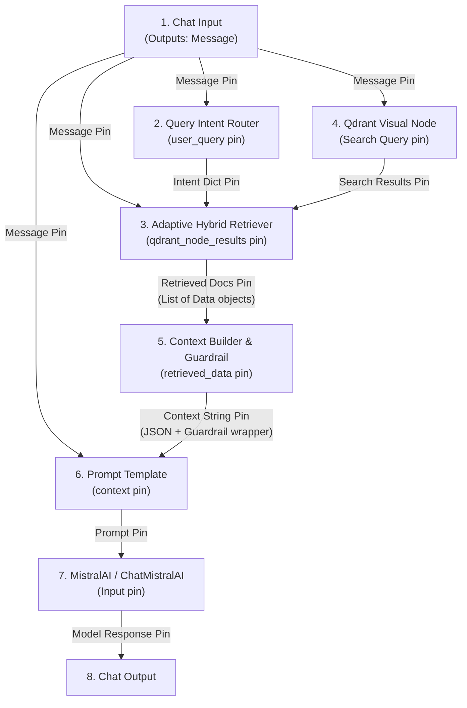

# Langflow Modular Visual Wiring Guide: Universal QA Assistant RAG

This guide details the exact node-to-node connections across your **Langflow Studio UI** for both Ingestion (`Flow 1`) and Retrieval (`Flow 2`). Every single input pin, output pin, and parameter setting is mapped below.

---

## Part 1: Ingestion & Auto-Versioning Flow (`Flow 1`)

For your 1,000-row e-commerce test case dataset (`ecommerce_test_cases.csv`), you only need **4 visual nodes** on your canvas. 

Because our custom component `AdaptiveMultiFormatChunker.py` natively reads CSV tables, slices `1 row = 1 atomic Test Case`, attaches rich dictionary metadata (`TID`, `Priority`, `Status`, `Module`), and queries Qdrant to auto-increment `version = v1/v2`, **you do not need `Docling` or `Parser` nodes on your canvas.**

### 1. Visual Architecture Diagram (`Flow 1`)

---

### 2. Complete Node Pin Mapping Table (`Flow 1`)

| Node # & Name | Langflow Component Type | Input Parameters & Configuration Setup | Output Pin Name | Connects To (Target Node & Input Pin) |
| :--- | :--- | :--- | :--- | :--- |
| **Node 1. Read File** | `Read File` / `File Loader` | • **File Path / Upload**: Select or browse to `d:\ai_3x_qa\git_hub_files\11072026\ecommerce_test_cases.csv` | `Structured Content` / `Data` | $\rightarrow$ Connect to **Node 2** (`input_data` Pin) |
| **Node 2. Adaptive Chunker** | `Custom Component` *(Paste code from `AdaptiveMultiFormatChunker.py`)* | • **input_data**: *(Connected directly from Node 1)* • **project_name**: `ecommerce_test_cases` • **version_tag**: `v1` | `Output Documents` | $\rightarrow$ Connect to **Node 3** (`documents` Pin) |
| **Node 3. Qdrant Writer** | `Qdrant` (`Vector Store Writer` / `Ingest`) | • **Collection Name**: `ecommerce_test_cases` *(Must match `project_name` exactly)* • **Qdrant URL**: `http://localhost:6333` • **Vector Size**: `1024` • **Distance Metric**: `Cosine` | `Vector Store` / `Success` | *(End of Ingestion Flow)* |
| **Node 4. Mistral Embeddings** | `MistralAIEmbeddings` (`Embeddings Engine`) | • **Model Name**: `mistral-embed` • **Mistral API Key**: Paste your `MISTRAL_API_KEY` | `Embeddings` | $\rightarrow$ Connect to **Node 3** (`embedding` Pin) |

---

### 3. Step-by-Step Wiring Checklist for `Flow 1`

- [ ] **Step 1: Add Read File (`Node 1`)**
  - Drag `Read File` (or `File Loader`) onto the canvas. Click `Browse` / `Upload` and select `ecommerce_test_cases.csv`.
  - Notice that `Read File` outputs two pins on the right side: **`Table`** and **`Message`**.
- [ ] **Step 2: Add Custom Component (`Node 2: Adaptive Chunker`)**
  - Drag a blank `Custom Component` onto the canvas. Click the **Code (`< >`) button**, delete the default template, and paste the entire code from `AdaptiveMultiFormatChunker.py`. Click **Check & Save**.
  - Notice the universal **`input_data`** pin appear on the left side of the block (`HandleInput` compatible with Table/Message)!
  - **Connect the pins**: Grab either the **`Table`** pin OR the **`Message`** pin from `Read File` (`Node 1`) and drag it straight into **`input_data`** on `Adaptive Chunker` (`Node 2`). It will snap cleanly!
  - Type `ecommerce_test_cases` into the `project_name` box, and `v1` into the `version_tag` box.
- [ ] **Step 3: Add Mistral Embeddings (`Node 4`)**
  - Drag `MistralAIEmbeddings` onto the canvas. Set model to `mistral-embed` and paste your `MISTRAL_API_KEY`.
- [ ] **Step 4: Add Qdrant Writer (`Node 3`) and Connect Everything**
  - Drag `Qdrant` (Writer/Ingest block) onto the canvas. Set `Collection Name` to `ecommerce_test_cases`.
  - Connect **Node 2 (`Output Documents` pin)** $\rightarrow$ **Node 3 (`documents` pin)**.
  - Connect **Node 4 (`Embeddings` pin)** $\rightarrow$ **Node 3 (`embedding` pin)**.
- [ ] **Step 5: Run Ingestion!**
  - Click the **Play (`▷`) button** on the Qdrant Writer block (`Node 3`).
  - *Result*: Exactly 1,000 atomic vector chunks with full dictionary metadata (`TID`, `Priority`, `Status`, `Module`, `version="v1"`) will be extracted and saved instantly to your Qdrant database!

---

## Part 2: Modular Dual-Mode Retrieval & QA Assistant Flow (`Flow 2`)

For your low-code RAG & Retrieval canvas (`Flow 2`), every single node now features explicit blue connection circle pins (`HandleInput`) so wires snap cleanly across the canvas while keeping your visual **`Qdrant`** database node intact.

### 1. Visual Architecture Diagram (`Flow 2`)

---

### 2. Complete Node Pin Mapping Table (`Flow 2`)

| Node # & Name | Langflow Component Type | Input Parameters & Connection Setup | Output Pin Name | Connects To (Target Node & Input Pin) |
| :--- | :--- | :--- | :--- | :--- |
| **Node 1. Chat Input** | `Chat Input` | • Captures live user question (`"How many critical tests?"` or `"Show failed login cases"`) | `Message` | $\rightarrow$ **Node 2** (`user_query` pin) $\rightarrow$ **Node 3** (`user_query` pin) $\rightarrow$ **Node 4** (`Search Query` pin) $\rightarrow$ **Node 6** (`question` pin) |
| **Node 2. Query Intent Router** | `Custom Component` *(Paste `QueryIntentRouter.py`)* | • **user_query** (`HandleInput` circle): Connect **Chat Input (`Message` pin)** | `Intent Dict` | $\rightarrow$ **Node 3** (`intent_dict` pin) |
| **Node 3. Adaptive Hybrid Retriever** | `Custom Component` *(Paste `AdaptiveQdrantHybridRetriever.py`)* | • **user_query** (`HandleInput` circle): Connect **Chat Input (`Message` pin)** • **intent_dict** (`HandleInput` circle): Connect **Node 2 (`Intent Dict` pin)** • **qdrant_node_results** (`HandleInput` circle): Connect **Node 4 (`Search Results` pin)** • **project_name**: `ecommerce_test_cases` • **qdrant_url**: `http://qdrant:6333` • **top_k**: `15` | `Retrieved Docs` | $\rightarrow$ **Node 5** (`retrieved_data` pin) |
| **Node 4. Qdrant Visual Node** | `Qdrant` (`Vector Store Search`) | • **Collection Name**: `ecommerce_test_cases` • **Host / URL**: `http://qdrant` • **Port**: `6333` • **Search Query**: Connect **Chat Input (`Message` pin)** | `Search Results` | $\rightarrow$ **Node 3** (`qdrant_node_results` pin) |
| **Node 5. Context Builder** | `Custom Component` *(Paste `ContextBuilder.py`)* | • **retrieved_data** (`HandleInput` circle): Connect **Node 3 (`Retrieved Docs` pin)** • **project_name**: `ecommerce_test_cases` • **confidence_threshold**: `0.50` | `Context Message (For Prompt Template)` | $\rightarrow$ **Node 6** (`context` pin) |
| **Node 6. Prompt Template** | `Prompt Template` | • Copy and paste the exact template text from `HardenedQARagPrompt.md` • **project_name**: Type `ecommerce_test_cases` • **question**: Connect **Chat Input (`Message` pin)** • **context**: Connect **Node 5 (`Context Message` pin)** | `Prompt` | $\rightarrow$ **Node 7** (`Input` pin) |
| **Node 7. MistralAI LLM** | `MistralAI` / `ChatMistralAI` | • **Model Name**: `codestral-latest` or `mistral-large-latest` • **Temperature**: `0.1` • **Mistral API Key**: Paste your `MISTRAL_API_KEY` • **Input**: Connect **Node 6 (`Prompt` pin)** | `Model Response` | $\rightarrow$ **Node 8** (`Input` pin) |
| **Node 8. Chat Output** | `Chat Output` | • Displays exact grounded QA answer or explicit `<0.5` guardrail fallback | *(Visual Chat UI)* | *(End of Retrieval Flow)* |

---

### 3. Step-by-Step Wiring Checklist for `Flow 2`

- [ ] **Step 1: Update Custom Component Code in Langflow Studio (`Node 2` & `Node 3`)**
  - Click `< > Code` on `Query Intent Router` (`Node 2`), paste all code from `QueryIntentRouter.py`, and click **Save Code**. Notice the blue connection pin appear next to `User Query / Question (Connect Chat Input)`.
  - Click `< > Code` on `Adaptive Qdrant Hybrid Retriever` (`Node 3`), paste all code from `AdaptiveQdrantHybridRetriever.py`, and click **Save Code**. Notice the blue connection pins appear next to `User Query / Question`, `Intent Dict`, and `Qdrant Node Results`.
  - Check `Context Builder` (`Node 5`): verify its code matches `ContextBuilder.py` (`retrieved_data` pin).

- [ ] **Step 2: Connect `Chat Input` (`Node 1`) across the Canvas**
  - Drag a wire from **`Chat Input` (`Message` pin)** $\rightarrow$ **`Query Intent Router` (`user_query` pin)**.
  - Drag a wire from **`Chat Input` (`Message` pin)** $\rightarrow$ **`Adaptive Qdrant Hybrid Retriever` (`user_query` pin)**.
  - Drag a wire from **`Chat Input` (`Message` pin)** $\rightarrow$ **`Qdrant Visual Node` (`Search Query` pin)**.
  - Drag a wire from **`Chat Input` (`Message` pin)** $\rightarrow$ **`Prompt Template` (`question` pin)**.

- [ ] **Step 3: Connect Router & Qdrant into the Hybrid Retriever (`Node 3`)**
  - Drag a wire from **`Query Intent Router` (`Intent Dict` pin)** $\rightarrow$ **`Adaptive Qdrant Hybrid Retriever` (`intent_dict` pin)**.
  - Drag a wire from **`Qdrant Visual Node` (`Search Results` pin)** $\rightarrow$ **`Adaptive Qdrant Hybrid Retriever` (`qdrant_node_results` pin)**. *(Preserves your visual low-code vector store integration!)*

- [ ] **Step 4: Connect Retriever $\rightarrow$ Context Builder $\rightarrow$ Prompt $\rightarrow$ LLM $\rightarrow$ Output**
  - Drag a wire from **`Adaptive Qdrant Hybrid Retriever` (`Retrieved Docs` pin)** $\rightarrow$ **`Context Builder` (`retrieved_data` pin)**.
  - Drag a wire from **`Context Builder` (`Context Message` pin)** $\rightarrow$ **`Prompt Template` (`context` pin)**.
  - Drag a wire from **`Prompt Template` (`Prompt` pin)** $\rightarrow$ **`MistralAI` (`Input` pin)**.
  - Drag a wire from **`MistralAI` (`Model Response` pin)** $\rightarrow$ **`Chat Output`**.

- [ ] **Step 5: Test in the Playground (`⚡`)!**
  - Open the **Chat Playground** (`⚡ Playground` in bottom right of Langflow Studio).
  - Test exact count aggregation: `How many critical test cases are in the e-commerce project?`
  - Test semantic Top-K search: `What test cases verify coupon discounts and shopping cart totals?`
  - Test guardrail interception (`confidence < 0.5`): `Tell me about flying spaceships on Mars.` $\rightarrow$ Instantly returns: *"I could not find relevant information in the knowledge base to answer your question."*
