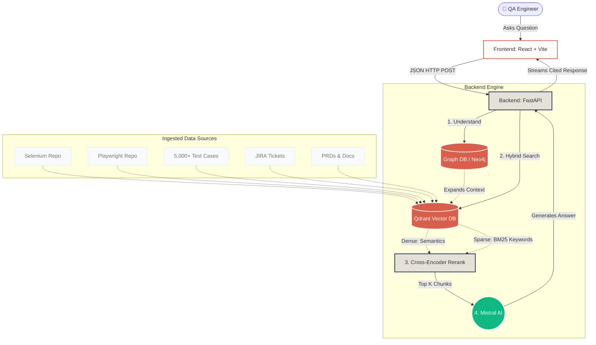

# QA Buddy: Architectural Knowledge Map

This document outlines the system architecture, design principles, and technologies that power **QA Buddy**, the advanced Hybrid RAG (Retrieval-Augmented Generation) knowledge system.

> [!NOTE]
> This system is designed to provide highly accurate, cited answers strictly grounded in your team's QA artifacts, preventing LLM hallucinations.

## 1. High-Level Architecture Flow

The system follows a strict 4-step pipeline whenever a user asks a question, utilizing both Graph relationships and Dense/Sparse vector embeddings to ensure maximum retrieval accuracy.

## 2. Technology Stack

| Layer | Technology | Purpose |
| :--- | :--- | :--- |
| **Frontend** | React 18, Vite, TailwindCSS | Provides a blazingly fast, premium "Apple-like" interface. Uses `react-markdown` to render formatted LLM responses. |
| **Design System** | Glassmorphism, Inter/Playfair | Combines warm backgrounds (`#FCFBF9`) with frosted glass components (`backdrop-blur`) and deep orange accents (`#D95F4D`). |
| **Backend** | Python, FastAPI | Serves as the orchestration layer, handling state, chunking, and API routing asynchronously. |
| **Vector Search** | Qdrant | Stores chunked documents as high-dimensional vectors and performs Hybrid (Dense + BM25 Sparse) search. |
| **Knowledge Graph** | Neo4j (GraphRAG) | Maps entities (e.g., *Login Feature* &rarr; *Test Case #504* &rarr; *JIRA-102*) for complex multi-hop reasoning. |
| **LLM Engine** | Mistral AI | Responsible for embedding creation and final synthesized generation strictly from retrieved context. |

## 3. The 4-Step Retrieval Process

> [!TIP]
> The backend employs **Reciprocal Rank Fusion (RRF)** to combine the results from the Dense search (meaning) and the Sparse search (exact keyword match), ensuring things like specific Exception IDs or Variable Names are never missed.

1. **Understand**: The user's raw question is passed to a query-rewriter which expands it into multiple variants to maximize search surface area.
2. **Hybrid Search**: Qdrant executes two simultaneous searches:
   - *Dense*: Looks for semantic meaning (e.g. "how does checkout fail" matches "payment processing errors").
   - *Sparse*: Looks for exact keyword matches (e.g. "Error 504", "click_login_button").
3. **Fuse & Rerank**: The results are merged. A Cross-Encoder model scores the top chunks against the user's question, keeping only the absolute most relevant data.
4. **Cited Answer**: Mistral AI generates the final response, injecting `[n]` citations that point back to the exact file, JIRA ticket, or script line number the fact was extracted from.

## 4. UI/UX Paradigm

> [!IMPORTANT]
> The frontend is built to inspire confidence. When an LLM interface looks cheap, users distrust the data. 

- **Floating Input**: The input bar is detached and floats above a subtle gradient, ensuring it always feels accessible.
- **Micro-interactions**: Hovering over the Send button or Suggestion Chips triggers smooth, 300ms transitions.
- **Empty State Hero**: Welcomes the user with a massive typography-driven explanation of capabilities before they even type a word.
- **Real-time Synchronization**: The sidebar actively polls the FastAPI `/progress` endpoint to keep the chunk counts and extraction status strictly mapped to the physical Qdrant database state.
